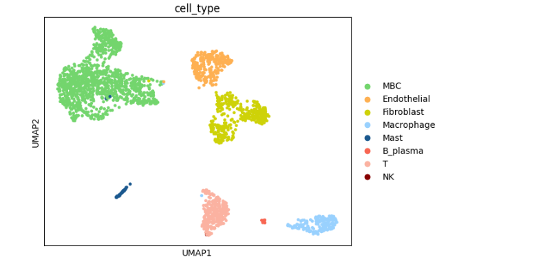

## Breast Cancer Literature
Inrtoduction

## Repository
This repository include two version nof code .One is from python and one is from R

###  Pre-requisite for python

`python install -r requirements.txt`

It will install all the pre-requisite libraries.

**Output**

###  Pre-requisite for R

Install R , R-studio , conda to run pip libraries

